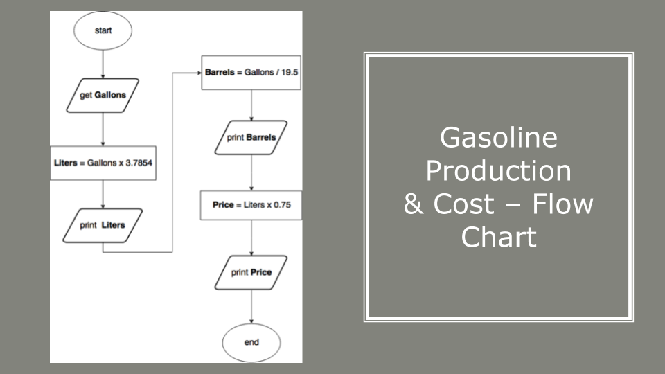

# Coding Challenge - 007: Calculate the Gasoline Production & Cost

The purpose of this coding challenge is to write a program that calculates gasoline usage depending on the given information.

## Learning Outcomes

At the end of this coding challenge, students will be able to;

- analyze a problem, identify, and apply programming knowledge for appropriate solution.

- design, implement `arithmetic operators` and  `string formatting` effectively in Python to solve the given problem.

- demonstrate their knowledge of algorithmic design principles by using solving the problem effectively.

## Problem Statement

Write a program that will prompt the user for inputting a floating point number that stands for gallons of gasoline. You will re-print that value along with other information about gasoline and gasoline usage:

- Amount of liters

- Amount of barrels of oil required to make this amount of gasoline

- Price in US dollars

Here are some approximate conversion values:

- 1 gallon is equivalent to 3.7854 liters

- 1 barrel of oil approximately produces 19.5 gallons of gas

- God knows what the cost should be, but let’s assume it $0.75/liter

Example of user inputs and respective outputs.

```text
Input
------------------------------
Enter a number which stands for gallons of gasoline: 15

Output
------
15.0 gallon(s) = 56.781 liter(s).

0.7692307692307693 barrel(s) of oil required to produce 15.0 gallon(s) of gas

It will cost 42.58575 dollar(s).

Input
------------------------------
Enter a number which stands for gallons of gasoline: 16.7

Output
------
16.7 gallon(s) = 63.21618 liter(s).

0.8564102564102564 barrel(s) of oil required to produce 16.7 gallon(s) of gas

It will cost 47.412135 dollar(s).
```

## Solution

### Flow Chart



### Coding

```python
gallon = float(input("Enter amount of gallons: "))
liter = gallon * 3.7854
barrel = gallon / 19.5
cost = liter * 0.75

print(str(barrel) + " barrel(s) of oil required to produce " + str(gallon) + " gallon(s) of gas")
print("It wil cost " + str(cost) + " dollar(s)")
```
